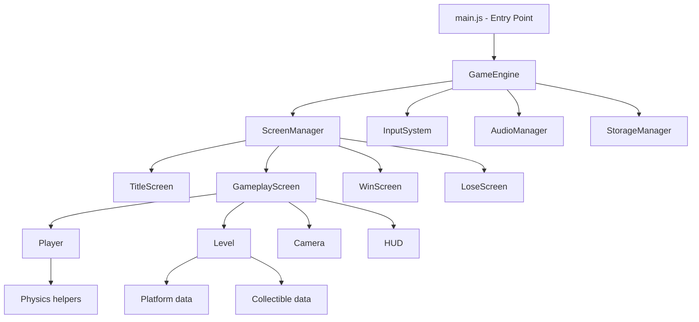
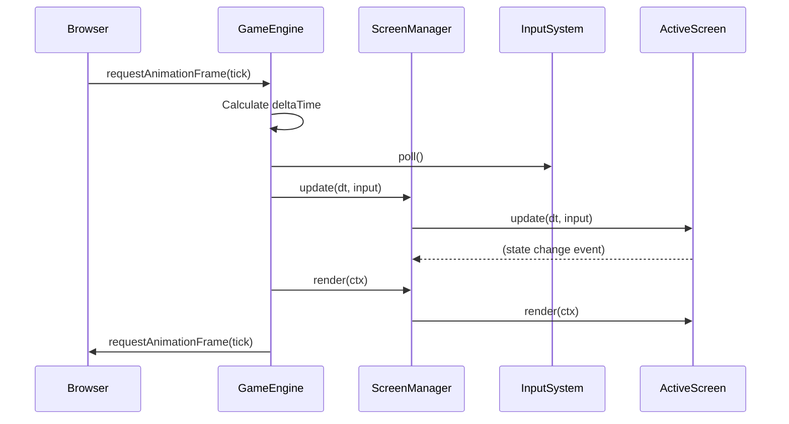
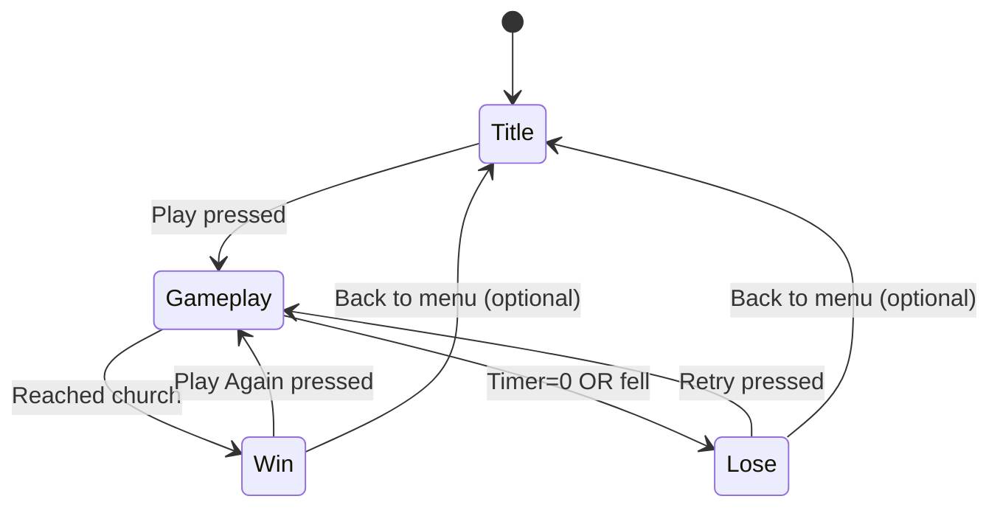

# Design Document: Wedding Platformer — "Run to the Altar!"

## Overview

"Run to the Altar!" is a 2D pixel-art side-scrolling platformer built entirely with vanilla JavaScript and Canvas 2D. The player controls a groom running to reach his wedding at the church within a 20-second time limit, collecting optional items (bouquet and ring) along the way. The architecture is a simple game loop with modular systems for input, physics, rendering, audio, and state management. All code runs client-side with no dependencies, frameworks, or build tools.

The game uses a 320×180 virtual canvas scaled with nearest-neighbor interpolation to maintain crisp pixel art at any resolution. It targets mobile browsers primarily (touch controls) and desktop secondarily (keyboard controls).

## Architecture





## Project File/Folder Structure

```
invitegame/
├── index.html              # Single HTML entry point
├── css/
│   └── style.css           # Minimal layout, scaling, safe-area CSS
├── js/
│   ├── main.js             # Entry point, bootstrap
│   ├── engine.js           # GameEngine: loop, timing, canvas setup
│   ├── input.js            # InputSystem: keyboard + touch
│   ├── player.js           # Player: physics, animation state
│   ├── level.js            # Level: platform/collectible data, generation
│   ├── camera.js           # Camera: viewport scrolling
│   ├── hud.js              # HUD: timer, collectibles, mute button
│   ├── screens.js          # ScreenManager + individual screen classes
│   ├── audio.js            # AudioManager: music, SFX, mute
│   ├── storage.js          # StorageManager: LocalStorage wrapper
│   └── constants.js        # Shared constants (sizes, speeds, colors)
├── assets/
│   ├── sprites/            # Sprite atlas PNGs
│   │   ├── groom.png       # Player spritesheet (idle, run, jump)
│   │   ├── tiles.png       # Platform tiles
│   │   ├── collectibles.png# Bouquet + ring sprites
│   │   └── church.png      # Finish-line church
│   ├── audio/
│   │   ├── bgm.mp3         # Background music loop
│   │   ├── jump.mp3        # Jump SFX
│   │   ├── collect.mp3     # Collect SFX
│   │   ├── win.mp3         # Win jingle
│   │   └── lose.mp3        # Lose SFX
│   └── ui/
│       └── buttons.png     # Touch control button sprites
└── README.md
```

## Core Modules

### GameEngine (engine.js)

Responsibilities:
- Create and manage the virtual canvas (320×180)
- Handle nearest-neighbor scaling to fill the viewport
- Run the game loop via `requestAnimationFrame`
- Calculate delta-time between frames (capped at 1/30s to prevent spiral)
- Pause when the browser tab loses visibility
- Coordinate update/render cycle through ScreenManager

```javascript
// Core interface
class GameEngine {
  constructor(canvasElement)
  start()                    // Begin the game loop
  pause()                    // Freeze updates
  resume()                   // Resume updates
  tick(timestamp)            // RAF callback: dt calc → update → render
  resize()                   // Recalculate scaling on window resize
}
```

**Delta-time capping**: If `dt > 1/30`, clamp to `1/30` to avoid physics tunneling on slow frames.

### InputSystem (input.js)

Responsibilities:
- Track keyboard state (keydown/keyup)
- Render and track touch button state (pointer events)
- Support multi-touch (hold direction + jump simultaneously)
- Provide a unified input state object each frame
- Detect device type (touch vs. keyboard) for UI toggling

```javascript
// Unified input state returned each frame
const inputState = {
  left: false,
  right: false,
  jump: false,       // true on the frame jump is first pressed
  jumpHeld: false,   // true while jump is held
  mute: false,       // true on frame mute is toggled
  pause: false,      // true on frame pause is pressed
  confirm: false     // true on frame confirm/enter is pressed
}

class InputSystem {
  constructor(canvas)
  poll()               // Returns current inputState snapshot
  isTouchDevice()      // Returns boolean
  showTouchControls()  // Render on-screen buttons
  hideTouchControls()  // Remove on-screen buttons
}
```

Touch buttons are HTML elements overlaid on the canvas (not drawn on canvas) so they respond to native pointer events and accessibility tools.

### Player (player.js)

Responsibilities:
- Store position (x, y), velocity (vx, vy), and dimensions
- Apply horizontal movement based on input
- Apply gravity and jump impulse
- Track grounded state for jump gating
- Manage animation state (idle, run, jump)
- Handle sprite flipping for direction

```javascript
class Player {
  constructor(x, y)
  update(dt, input, platforms)   // Physics + state update
  render(ctx, camera)            // Draw current animation frame
  reset(x, y)                    // Reset to start position
  getBounds()                    // Returns AABB {x, y, w, h}
}
```

**Physics constants:**
- Gravity: `980 px/s²` (virtual pixels)
- Jump impulse: `-280 px/s` (upward)
- Horizontal speed: `120 px/s`
- Player size: `16×24 px`

### Level (level.js)

Responsibilities:
- Define platform segments as an array of AABB rectangles
- Define gap positions (absence of platform)
- Place collectibles at specific coordinates
- Place the church finish trigger at the end
- Provide collision query methods

```javascript
class Level {
  constructor()
  getPlatforms()          // Returns array of {x, y, w, h}
  getCollectibles()       // Returns array of {x, y, w, h, type, collected}
  getFinishArea()         // Returns {x, y, w, h}
  getLevelWidth()         // Total width in virtual pixels
  collectItem(index)      // Mark collectible as collected
  reset()                 // Reset all collectibles
}
```

**Level layout**: Total width ~1600 virtual pixels (roughly 5 screens). Platforms are 16px tall, placed at y=156 (bottom area), with 32–48px gaps.

### Camera (camera.js)

Responsibilities:
- Follow player horizontally with an offset (player at ~30% from left)
- Clamp to level boundaries (no showing past start/end)
- No vertical scrolling (single-height level)

```javascript
class Camera {
  constructor(viewWidth, viewHeight, levelWidth)
  follow(playerX)         // Update camera x based on player
  getOffset()             // Returns {x: number, y: 0}
}
```

### HUD (hud.js)

Responsibilities:
- Render timer (top-center)
- Render collectible indicators (below timer or top-left)
- Render mute button (top-right, 48×48 touch target)
- Adapt layout for mobile vs. desktop

```javascript
class HUD {
  constructor()
  update(timerValue, collectibles, isMuted)
  render(ctx)
  handleClick(x, y)      // Check if mute button was tapped
}
```

### ScreenManager (screens.js)

Responsibilities:
- Manage active screen state machine
- Handle transitions between screens
- Delegate update/render to active screen

```javascript
// State machine
// TITLE → GAMEPLAY → WIN
//                  → LOSE → GAMEPLAY
//         WIN → GAMEPLAY (replay)

class ScreenManager {
  constructor(engine, input, audio, storage)
  switchTo(screenName, data)
  update(dt, input)
  render(ctx)
}
```

Each screen is a simple object with `enter(data)`, `update(dt, input)`, `render(ctx)`, and `exit()` methods.

### AudioManager (audio.js)

Responsibilities:
- Preload audio files as HTMLAudioElement or AudioBuffer
- Play/stop background music with looping
- Play one-shot sound effects
- Respect mute state (persisted via StorageManager)
- Handle browser autoplay restrictions (require user gesture)

```javascript
class AudioManager {
  constructor()
  preload(manifest)        // Load all audio files
  playMusic(key)           // Start looping music
  stopMusic()              // Stop current music
  playSFX(key)             // Play one-shot effect
  setMuted(muted)          // Toggle mute
  isMuted()                // Get mute state
}
```

### StorageManager (storage.js)

Responsibilities:
- Save/load best time from LocalStorage
- Save/load mute preference
- Handle missing or corrupted data gracefully

```javascript
class StorageManager {
  getBestTime()            // Returns number|null
  setBestTime(time)        // Saves if better than existing
  getMuteState()           // Returns boolean
  setMuteState(muted)     // Persist mute toggle
}
```

## Canvas Rendering Approach

The game uses a **fixed virtual resolution** of 320×180 pixels:

1. An offscreen `<canvas>` (320×180) is the render target for all game drawing
2. A visible `<canvas>` fills the viewport (CSS `width: 100%; height: 100%`)
3. Each frame, the offscreen canvas is drawn onto the visible canvas using `drawImage()` with `imageSmoothingEnabled = false` for nearest-neighbor scaling
4. On window resize, the visible canvas dimensions are recalculated to maintain 16:9 aspect ratio with letterboxing (black bars)

```javascript
// Scaling logic (in engine.js resize())
const scaleX = window.innerWidth / 320;
const scaleY = window.innerHeight / 180;
const scale = Math.min(scaleX, scaleY);
visibleCanvas.width = Math.floor(320 * scale);
visibleCanvas.height = Math.floor(180 * scale);
```

This ensures pixel-perfect rendering at any display resolution without blurring.

## Game Loop Design

```javascript
// Simplified game loop
let lastTime = 0;
const MAX_DT = 1 / 30; // Cap to prevent physics explosion

function tick(timestamp) {
  let dt = (timestamp - lastTime) / 1000;
  lastTime = timestamp;
  if (dt > MAX_DT) dt = MAX_DT;

  const input = inputSystem.poll();
  screenManager.update(dt, input);
  
  // Clear virtual canvas
  vctx.clearRect(0, 0, 320, 180);
  screenManager.render(vctx);
  
  // Scale to display canvas
  displayCtx.imageSmoothingEnabled = false;
  displayCtx.drawImage(virtualCanvas, 0, 0, displayCanvas.width, displayCanvas.height);
  
  requestAnimationFrame(tick);
}
```

Pause logic: `document.addEventListener('visibilitychange', ...)` pauses/resumes the loop.

## State Machine for Screens



Each screen handles its own rendering and input processing. The ScreenManager simply delegates.

## Physics System

### Gravity and Movement

Per-frame update (in Player.update):

```javascript
// Horizontal movement
if (input.left) this.vx = -MOVE_SPEED;
else if (input.right) this.vx = MOVE_SPEED;
else this.vx = 0;

// Gravity
this.vy += GRAVITY * dt;

// Jump (only when grounded)
if (input.jump && this.grounded) {
  this.vy = JUMP_IMPULSE; // negative = upward
  this.grounded = false;
}

// Apply velocity
this.x += this.vx * dt;
this.y += this.vy * dt;
```

### Collision Detection (AABB)

Platform collision uses simple AABB overlap test:

```javascript
function aabbOverlap(a, b) {
  return a.x < b.x + b.w &&
         a.x + a.w > b.x &&
         a.y < b.y + b.h &&
         a.y + a.h > b.y;
}
```

**Platform resolution**: After moving the player, check overlap with each platform. If overlapping and player was above the platform in the previous frame (falling down), snap player's `y` to platform top and set `grounded = true`, `vy = 0`.

**Collectible detection**: Simple overlap check → mark collected, play SFX.

**Finish area detection**: Overlap with church AABB → trigger win.

**Fall detection**: If `player.y > 180` → trigger lose.

## Asset Management Strategy

- **Sprite atlases**: Each spritesheet is a single PNG with frames laid out in a grid. Frame selection is done by source-rect in `drawImage()`.
- **Audio**: MP3 format for universal browser support. Files are preloaded on title screen via `Audio()` element with `preload="auto"`.
- **Lazy loading**: Audio files begin loading when the title screen renders. Game doesn't start until critical assets (player sprite, tiles) are loaded.
- **Size budget**: All assets combined < 10 MB. Individual assets < 1 MB.

## Responsive Scaling Logic

```javascript
function resize() {
  const maxW = window.innerWidth;
  const maxH = window.innerHeight;
  const scale = Math.floor(Math.min(maxW / 320, maxH / 180));
  const finalScale = Math.max(scale, 1); // At least 1x
  
  displayCanvas.style.width = (320 * finalScale) + 'px';
  displayCanvas.style.height = (180 * finalScale) + 'px';
  displayCanvas.width = 320 * finalScale;
  displayCanvas.height = 180 * finalScale;
}

window.addEventListener('resize', resize);
new ResizeObserver(resize).observe(document.body);
```

CSS handles centering and safe areas:

```css
body {
  margin: 0;
  background: #000;
  display: flex;
  align-items: center;
  justify-content: center;
  height: 100vh;
  overflow: hidden;
  padding: env(safe-area-inset-top) env(safe-area-inset-right)
           env(safe-area-inset-bottom) env(safe-area-inset-left);
}
```

## Technology Choices

| Concern | Choice | Rationale |
|---------|--------|-----------|
| Language | Vanilla JavaScript (ES2020+) | No build step, runs everywhere |
| Rendering | Canvas 2D API | Simple, performant for 2D sprites |
| Build tool | None | Static files, open index.html |
| Framework | None | Game is small enough to be self-contained |
| Audio | HTMLAudioElement | Simple API, universal support |
| Storage | LocalStorage | Synchronous, simple key-value |
| Hosting | Any static host | GitHub Pages, Netlify, S3, etc. |

## Correctness Properties

*A property is a characteristic or behavior that should hold true across all valid executions of a system — essentially, a formal statement about what the system should do. Properties serve as the bridge between human-readable specifications and machine-verifiable correctness guarantees.*

### Property 1: Delta-time physics consistency

*For any* sequence of frames with varying delta-time values (within the capped range 0 < dt ≤ 1/30), the player's vertical position after applying gravity for a total elapsed time T SHALL be equivalent regardless of how T is subdivided into individual frame deltas (within floating-point tolerance).

**Validates: Requirements 1.4, 2.6**

### Property 2: Platform collision prevents fall-through

*For any* player position above a platform with downward velocity, after a physics update the player's final y-position SHALL be at or above the platform surface, and the player SHALL be marked as grounded.

**Validates: Requirements 2.5, 3.2**

### Property 3: Jump gating invariant

*For any* input sequence, the player SHALL only gain upward velocity from a jump input when the grounded state is true. While airborne, jump inputs SHALL NOT produce additional upward impulse.

**Validates: Requirements 2.3, 2.4**

### Property 4: Camera clamping within bounds

*For any* player x-position within the level, the camera offset SHALL be clamped such that `camera.x >= 0` and `camera.x + viewWidth <= levelWidth`.

**Validates: Requirements 7.2**

### Property 5: Collectible state consistency

*For any* collectible that has been collected, it SHALL NOT appear in subsequent render frames and SHALL NOT be collectable again. The collected count SHALL equal the number of collectibles marked as collected.

**Validates: Requirements 5.2, 5.4**

### Property 6: Timer monotonic decrease

*For any* sequence of gameplay updates with positive delta-time, the timer value SHALL strictly decrease and SHALL never go below zero.

**Validates: Requirements 4.1, 4.3**

### Property 7: AABB overlap symmetry

*For any* two axis-aligned bounding boxes A and B, `aabbOverlap(A, B)` SHALL equal `aabbOverlap(B, A)`.

**Validates: Requirements 3.2, 5.2**

### Property 8: Storage best-time monotonic improvement

*For any* sequence of completion times saved to storage, the stored best time SHALL always be less than or equal to any previously stored best time. A new time is saved only if it is strictly less than the current best.

**Validates: Requirements 10.1, 10.3**

### Property 9: Screen state machine valid transitions

*For any* sequence of user actions, the screen manager SHALL only transition between valid states as defined in the state diagram (Title→Gameplay, Gameplay→Win, Gameplay→Lose, Win→Gameplay, Lose→Gameplay).

**Validates: Requirements 8.1, 8.2, 8.3, 8.4, 8.5**

### Property 10: Input system multi-touch independence

*For any* combination of simultaneous touch inputs (left + jump, right + jump), each input channel SHALL report its state independently without one touch canceling or overriding another.

**Validates: Requirements 6.2, 6.5**

### Property 11: Animation state matches physics state

*For any* player state, the animation state SHALL be 'idle' when grounded and stationary, 'run' when grounded and moving horizontally, and 'jump' when airborne. The sprite facing direction SHALL match the last non-zero horizontal velocity direction.

**Validates: Requirements 12.1, 12.2, 12.3, 12.4**
